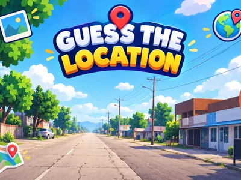
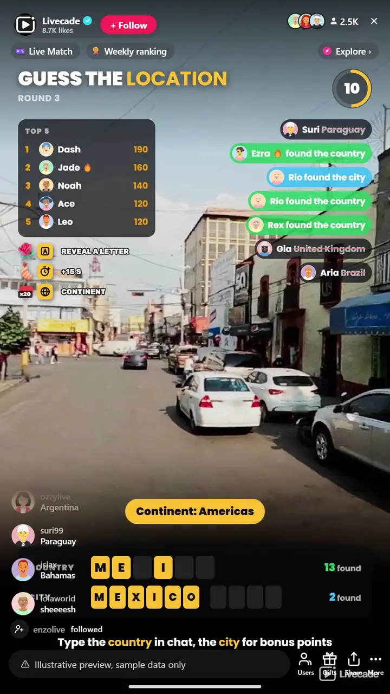

# Guess the Location - Interactive TikTok Live Game

> Name the country from a real street photo.

A real 360 street photo turns slowly on your stream and your chat types the country. Naming the city scores a bonus, letters fill in as the clock runs, and a globe reveals the place at the end of every round.

**[Play Guess the Location on Livecade](https://livecade.io/games/guess-the-location/?utm_source=github&utm_medium=readme&utm_campaign=guess-the-location)** - runs as a single browser source in OBS, Streamlabs, or TikTok LIVE Studio. Nothing for viewers to install.

## How viewers play

Viewers take part with the actions TikTok already gives them: **comments**, **gifts**, **likes**. Every action below is rebindable, so you decide which interaction drives which effect.

| Action | What it does |
| --- | --- |
| **Reveal a Letter** | Uncovers a letter of the country, then of the city. A Rose by default |
| **Add 15 Seconds** | Gives the round 15 more seconds on the clock. A Finger Heart by default |
| **Show the Continent** | Names the continent the photo is on, once per round. 20 likes by default |

## How it works

### Read the street

A real 360 street photo turns slowly and zooms out over the round, so the longer chat looks, the more it sees.

### Name the country, then the city

Viewers type the country in chat in any of thirteen languages. The first to find it scores the most and each later finder a little less. Naming the city adds a bonus.

### Letters fill in

Letters of the country appear at 35%, 60% and 80% of the round, and of the city from the second one. Hints never uncover more than 60% of a name, so the answer is always typed by chat.

### The globe reveals it

When the timer ends, a globe turns to the country and names the place, then lists everyone who found it before the next photo loads.

## About the game

Guess the Location drops your chat onto a real street somewhere in the world. A 360 photo turns slowly on screen and widens as the round runs, so more clues come into view: road signs, shop fronts, cars, plants and the side of the road people drive on. Viewers type the country in chat, and naming the nearest city on top scores a bonus.

### Built for a busy chat

A correct guess never gives the answer away: the feed just says the viewer found the country or the city, while wrong guesses show struck through so chat can rule them out. Country names count in all thirteen languages at once, along with the everyday short forms like USA, UK and Holland, so "Brasil" scores on an English stream. Letters of the country and the city fill in at set points of the round, then a globe turns to the country and names the place along with everyone who found it.

### 77 countries, no repeats in a row

Over 2,700 street photos across 77 countries. The game picks the country first, so a country with few photos comes up as often as one with many, and none of the last eight countries come back. Photos you have already played are held back while there are new ones to show. Keep the whole world in play or pick one continent: Europe, the Americas, Asia, Africa or Oceania.

## What it looks like on stream

[Watch Guess the Location gameplay](https://cdn.livecade.io/games/guess-the-location.mp4)

## What you can configure

- **Language** - Thirteen languages for the on-screen text and the names on the tiles. Guesses count in all thirteen
- **Photos from** - The whole world, or one continent: Europe, the Americas, Asia, Africa or Oceania
- **Answers** - The country only, or the country plus the city for bonus points
- **Round mode** - Everyone who finds it scores until the timer, or the first correct country wins the round
- **Round time** - From 20 to 120 seconds a photo, and how long the answer stays on screen
- **Letter hints** - Reveal letters over time, or leave the hints to gifts and likes
- **Rotation and zoom** - How fast the photo turns, and whether the view widens as the round runs
- **Scoring** - Points for the country and the bonus for the city
- **Guesses per viewer** - Optionally cap how many guesses each viewer gets per round
- **Match** - Play all stream, or end after a number of locations or at a target score, with a podium for the top three
- **Leaderboard** - Keep the top players on screen, from 3 to 10
- **Read the answer aloud** - Your stream voice reads the place and who found it first
- **Appearance** - Colors for the accent, the panels, the text, and the found country and city
- **Who can play** - Everyone, followers only, or your fans club only. Applies to comments and gifts

## Languages

English, Spanish, Portuguese, French, German, Italian, Indonesian, Arabic, Turkish, Russian, Hindi, Romanian, Filipino

## FAQ

<strong>How do viewers play Guess the Location?</strong>

They look at the street photo turning on your stream and type the country in your TikTok Live chat. Everyone who names it scores, the first the most, and naming the city on top adds a bonus.

<strong>Do viewers need to send gifts to play?</strong>

No. Guessing is free and comment-driven, and letters fill in on their own as the round runs. Gifts reveal a letter or add time, and likes name the continent, but no hint ever gives away the whole name.

<strong>How many places are there?</strong>

Over 2,700 street photos across 77 countries. A country comes up as often as any other, the last eight countries never repeat, and photos you have already played are held back while there are new ones to show.

<strong>Which languages does it support?</strong>

Thirteen: English, Spanish, Portuguese, French, German, Italian, Indonesian, Arabic, Turkish, Russian, Hindi, Romanian and Filipino. A guess counts in any of them, whatever language your stream is set to.

<strong>How do I add Guess the Location to my TikTok Live?</strong>

Add one browser source URL to OBS or your streaming software and go live. There is no plugin to install and nothing for your viewers to download.

## Setup

1. [Create a Livecade account](https://app.livecade.io/register?utm_source=github&utm_medium=cta&utm_campaign=guess-the-location)
2. Copy your overlay browser source URL
3. Paste it into OBS, Streamlabs, or TikTok LIVE Studio
4. Pick Guess the Location, set your triggers, and go live

Runs in the browser, so it works on Windows and macOS with nothing to download. [See all TikTok Live games](https://livecade.io/tiktok-live-games/?utm_source=github&utm_medium=readme&utm_campaign=guess-the-location).

---

_This repository documents Guess the Location, a hosted interactive game by [Livecade](https://livecade.io/?utm_source=github&utm_medium=footer&utm_campaign=guess-the-location). The game runs on Livecade's platform, so there is no source to install here._
